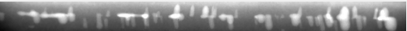
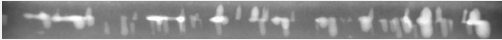
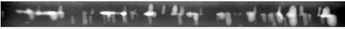
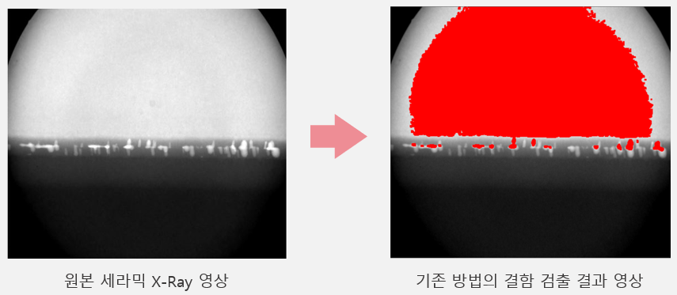
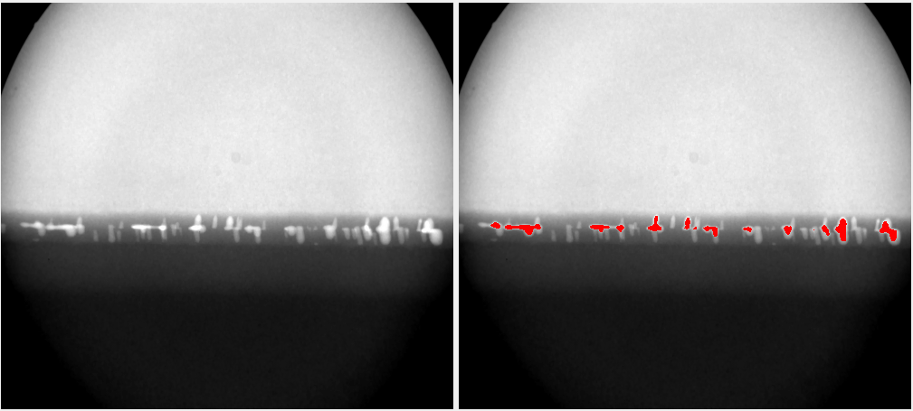
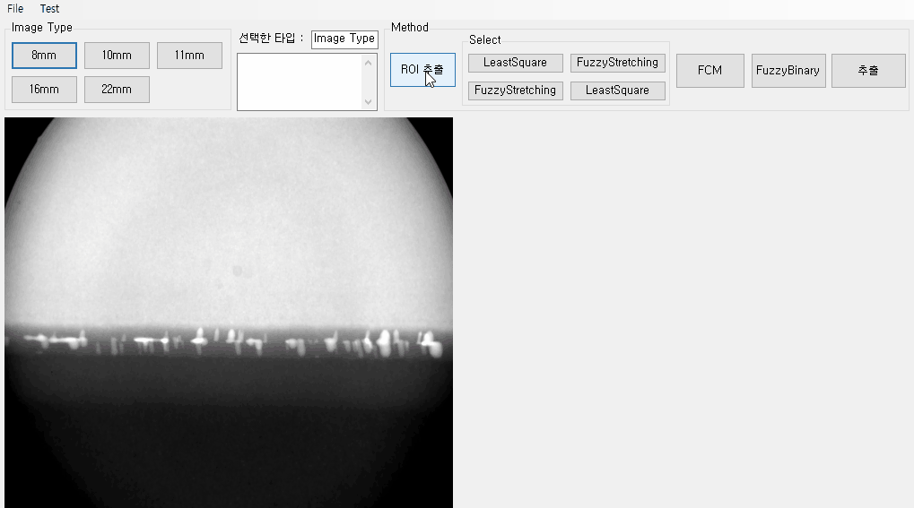
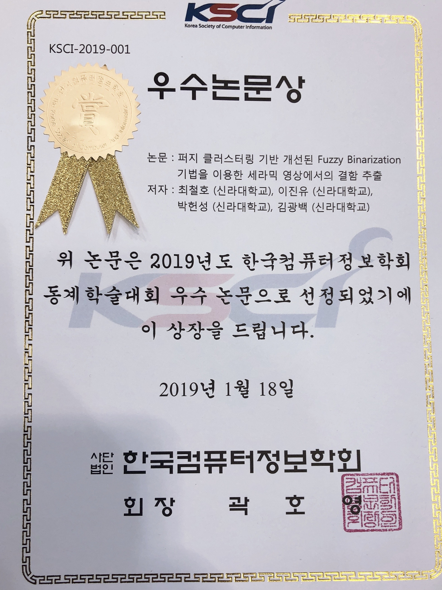

# 퍼지 클러스터링 기반 개선된 Fuzzy Binarization 기법을 이용한 세라믹 영상에서의 결함 추출

[PAPER 보기](imgs/paper.pdf)

 

> 개요

&nbsp;&nbsp;기존의 세라믹 소재 영상에서 결함을 검출하는 방법은 전체영상을 세분화하여, 각 세분화된 영역의 명암도 값 정보로 결함의 후보 객체를 추출하였다. 하지만 기존의 방법에서는 전체 영상에서 세분화된 영역과 결함이외의 영역까지 추출되거나 결함 영역이 추출되지 않는 문제점이 발생하였다. 이러한 문제점을 개선하기 위해 본 논문에서는 전체 영상의 세분화된 명암도 값의 차이를 이용하여 결함 영역을 추출하는 방법 대신 영상에서 결함 영역을 추출한 후 추출된 결함 영역의 명암도 값 정보를 이용해 개선된 Fuzzy Binarization 기법을 적용하여 결함의 후보 객체를 추출하는 방법을 제안한다.

 

> ### 프로젝트 기간

2018.11 ~ 2019.1

 

> ### 참여인원

| 역할         | 이름   | 기여도 |
| ------------ | ------ | ----- |
| 팀장       | 최철호 | 30% |
| 팀원      | 이진유 | 30% |
| 팀원     | 박헌성 | 30% |
| 지도교수 | 김광백 | - |

 

> ### 기능설명
- 영상 보정을 위한 전처리 및 ROI 영역 추출
  - 비등방성 확산 필터를 사용해 영상의 미세 잡음을 제거한다.
  
    
  - 용접 영역을 추출하기 위해 영상의 명암도 정보를 이용하여 수직 및 수평 히스트로그램을 각각 적용해 ROI 영역을 추출
    
    
  - 추출된 ROI 영역에서 결함 영역의 명암도 값과 결함 영역 외의 배경 밝기 명암도 값이 유사한 특성을 가지기 때문에 최소자승법을 적용해 배경 밝기 변화를 근사화한다.

    
  - 최소자승법이 적용으로 배경 밝기가 근사회된 ROI 영역을 퍼지 스트레칭 기법을 이용해 명암 대비를 강조함

    
    
 - 개선된 퍼지 이진화를 이용한 결함 영역 추출
   - 기존 방법에서 결함 영역 추출은 퍼지 이진화를 적용하는 과정에서 임계 구간을 설정하는 파라미터 값을 경험적으로 설정하기 때문에 결함 영역과 비결함 영역의 명암 대비가 영상 마다 다르기 때문에 부정확하게 추출되거나 추출되지 않는 경우가 있음
   - 본 논문에서는 임계 구간을 Fuzzy C-Means 클러스터링 기법을 적용해 생성된 클러스터의 중심값에 해당되는 명암도의 정보들을 이용하여 임계 구간을 동적으로 설정해 퍼지 이진화를 수행함
 
  
 
 > ### 실험 및 결과 분석

- 기존 논문에서의 검출 실패 영상

    
- 제안된 방법에서 검출한 영상
  
  

- 실행화면

  
 
 

> ### 결론 및 향후 연구 방향

&nbsp;&nbsp;기존의 추출 방법에서는 11mm 크기의 영상에서만 결함 영역의 추출률이 높게 나타났지만 제안된 방법에서는 8mm, 10mm, 11mm, 16mm, 22mm 크기의 영상에서 모두 결함 영역의 추출률이 높게 나타났다. 좋은 결과를 얻은 제안된 방법에서도 Fuzzy C-Means 클러스터링 알고리즘을 적용하기 위해 클러스터(군집)의 수를 정적으로 설정해줘야 한다. 이러한 문제점을 보완하기 위해 클러스터의 수를 동적으로 설정하는 방법이나 다층 구조로 Deep FCM 방법 등을 연구하여 개선할 것이다.

> ### 수상

